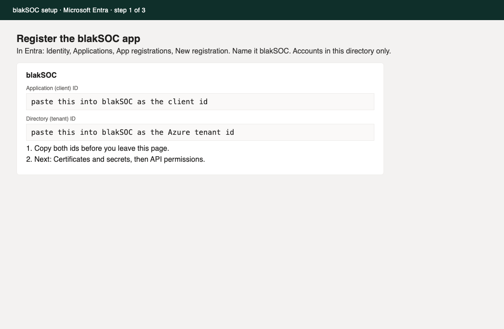
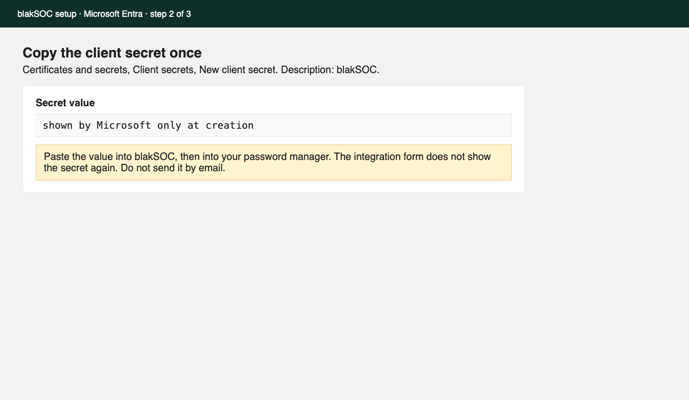
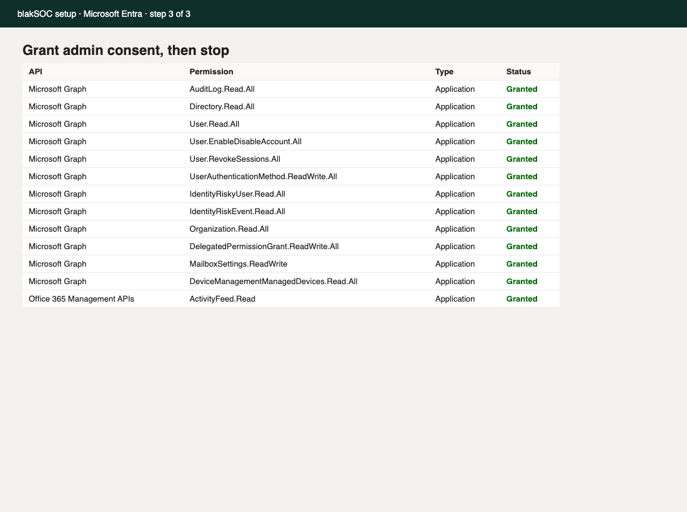

# Connect Microsoft 365

This guide is for the person who runs Microsoft 365 for your organisation. You do not need to be a security analyst. When you finish, blakSOC can read sign-ins and mailbox audit events, and (only after a person approves it) disable a user, revoke sessions, require MFA again, remove an inbox rule, or revoke an app consent.

blakSOC never asks you to paste a global admin password into this product. You create an app registration in Microsoft Entra, grant the permissions below, and paste the tenant id, application id, and client secret into the integration form. The secret is write-only. blakSOC does not show it again after you save.

## Quicker way: agree during setup

If Yuma IT runs your setup and the blakSOC connector app is configured, you do not need to register your own app. On the **Connect** step, a Microsoft 365 Global Administrator presses **Ask a Microsoft 365 admin to agree**, signs in, and accepts the permissions listed in step 3. blakSOC checks the consent by reading your organisation name and licences, then starts reading sign-ins within a minute of finishing setup.

To withdraw it later, delete the **blakSOC** enterprise application in Entra.

The rest of this guide is for organisations that want their own app registration instead.

### For Yuma IT operators: the connector app

1. Register one **multi-tenant** app (Accounts in any organizational directory). Keep it separate from the staff sign-in app (`ENTRA_CLIENT_ID`).
2. Add the redirect URI `${APP_URL}/onboarding/m365/callback` (Web platform).
3. Add the application permissions from step 3 below. Do not grant them in the Yuma IT tenant unless Yuma IT is a customer.
4. Create a client secret and set `M365_CONNECTOR_CLIENT_ID` and `M365_CONNECTOR_CLIENT_SECRET`. Each customer integration stores an encrypted copy, so a rotated secret must be updated on those integrations too.

Without these variables, setup records sample Microsoft 365 data instead.

## What you need

- A work account that can register apps and grant admin consent in Entra (Application Administrator or Global Administrator).
- About 15 minutes.
- The blakSOC integration page open in another tab.

## 1. Register the app

1. Open [https://entra.microsoft.com](https://entra.microsoft.com) and sign in.
2. Go to **Identity > Applications > App registrations > New registration**.
3. Name it `blakSOC`. Leave the supported account type as **Accounts in this organizational directory only**.
4. Register. Copy the **Application (client) ID** and the **Directory (tenant) ID**. You will paste both into blakSOC.

## 2. Add a client secret

1. On the app, open **Certificates & secrets > Client secrets > New client secret**.
2. Description: `blakSOC`. Pick an expiry your change calendar will remember (24 months is common).
3. Copy the **Value** immediately. Microsoft shows it once. This is the client secret. Store it in your password manager, then paste it into blakSOC. Do not email it.

## 3. Grant these permissions

Open **API permissions > Add a permission**. Add each application permission below, then choose **Grant admin consent**.

Microsoft Graph (application):

- AuditLog.Read.All
- Directory.Read.All
- User.Read.All
- User.EnableDisableAccount.All
- User.RevokeSessions.All
- UserAuthenticationMethod.ReadWrite.All
- IdentityRiskyUser.Read.All
- IdentityRiskEvent.Read.All
- Organization.Read.All
- DelegatedPermissionGrant.ReadWrite.All
- MailboxSettings.ReadWrite
- DeviceManagementManagedDevices.Read.All

Office 365 Management APIs (application):

- ActivityFeed.Read

The same list, as blakSOC records it on the connector:

- Microsoft Graph application: AuditLog.Read.All
- Microsoft Graph application: Directory.Read.All
- Microsoft Graph application: User.Read.All
- Microsoft Graph application: User.EnableDisableAccount.All
- Microsoft Graph application: User.RevokeSessions.All
- Microsoft Graph application: UserAuthenticationMethod.ReadWrite.All
- Microsoft Graph application: IdentityRiskyUser.Read.All
- Microsoft Graph application: IdentityRiskEvent.Read.All
- Microsoft Graph application: Organization.Read.All
- Microsoft Graph application: DelegatedPermissionGrant.ReadWrite.All
- Microsoft Graph application: MailboxSettings.ReadWrite
- Microsoft Graph application: DeviceManagementManagedDevices.Read.All
- Office 365 Management APIs application: ActivityFeed.Read

Do not add extra permissions "just in case". Response actions stay behind a human approval in blakSOC even after these are granted.

## 4. Save the integration in blakSOC

1. In blakSOC, open **Settings > Integrations > Microsoft Entra ID**.
2. Azure tenant id: the Directory (tenant) ID from step 1.
3. Mode: `live` for your real tenant. `fixture` is only for the built-in demo.
4. Subscribed SKUs: the part numbers from **Microsoft 365 admin center > Billing > Your products** (for example `O365_BUSINESS_ESSENTIALS`, `SPB`, `SPE_E5`). blakSOC uses these to show which signals your licence does not include. Business Basic does not include Identity Protection risk detections or Intune device inventory. A signal that returns "access denied" is shown as a coverage gap and polling continues.
5. Client id and client secret: the application id and the secret value. After save, the secret fields stay blank on purpose.

Health should turn green within one poll. Coverage gaps are normal on Business Basic and Business Standard. They are not a failed connection.

## What blakSOC does next

- Reads sign-in logs, directory audit, and the Exchange unified audit (inbox rules, forwarding, large sends, OAuth consent).
- Reads risky sign-ins and Intune devices only when your SKUs include them.
- Remembers a checkpoint so a restart does not raise the same alert twice.
- Raises business-email-compromise alerts for legacy sign-in, impossible travel plus mailbox activity, inbox rules that hide invoices or payments, external forwarding, MFA fatigue, suspicious mail consent, and mass sends.
- Containment (disable the user, revoke sessions, require MFA registration again, remove the inbox rule, revoke the OAuth grant) waits for an approver. Each request and each result is written to the audit log and the incident timeline.

## If something fails

| What you see | What to check |
| --- | --- |
| Health error about client id or secret | The secret expired, or the value was copied with a trailing space. Create a new secret and save it again. |
| Admin consent button is grey | The account you used cannot grant tenant-wide consent. Ask a Global Administrator. |
| Sign-ins work, risk detections show as a gap | The tenant does not have Entra ID P2 or Microsoft 365 E5. That is expected. |
| Devices missing | Intune is not in the subscribed SKUs, or DeviceManagementManagedDevices.Read.All was not consented. |
